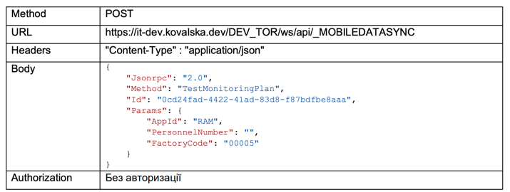

API повертає інформацію про технічне обладнання та технічне місце на заводі в ієрархічній структурі

Необхідно реалізувати програму (консольний додаток або WPF або MAUI) на мові програмування C#,
на платформі .NET 8 під операційну систему Windows 10, яка виводить на екран у вигляді дерева (в
ієрархічному вигляді) інформацію отриману по вищевказаному API: відображається значення полів
TechnicalPlaces.Name, Equipments.Name та MonitoringTasks.CharacteristicName.

Рівні ієрархії виокремити додатковими відступами від лівого кордону екрану.

Підрахувати кількість дочірніх елементів дерева та вивести цю кількість в кінці назви відповідного
материнського елементу дерева.

Для реалізації програми створити відповідні класи та методи дотримуючись принципу Single
Responsibility Principle.